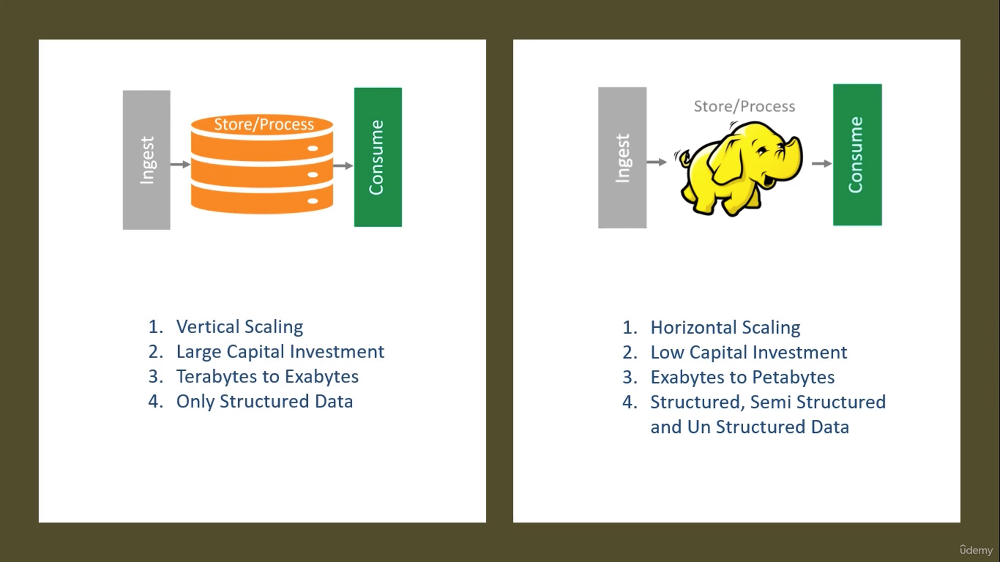
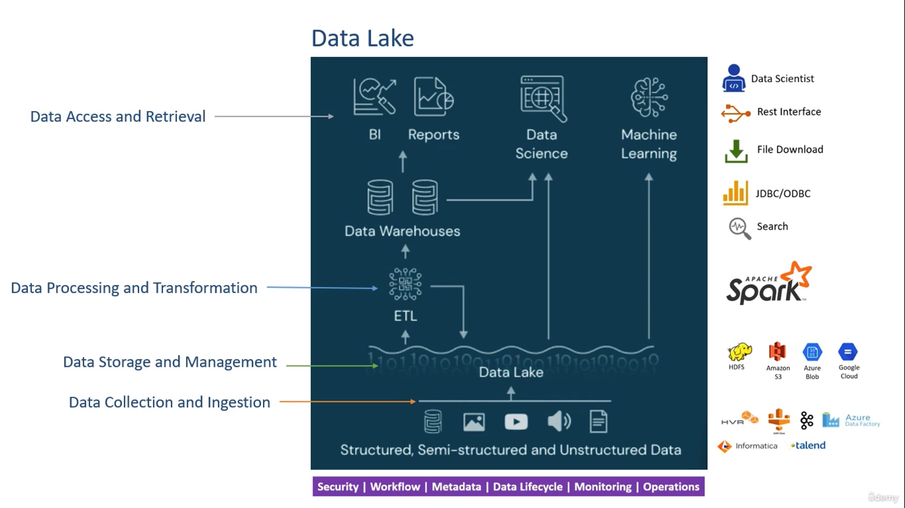
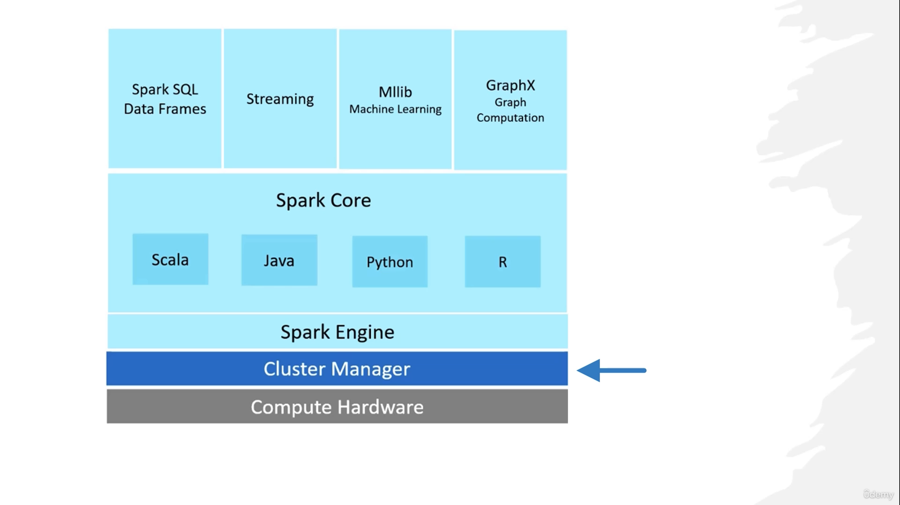

 # Apache-Spark

## Table of Contents

- [Overview](#Overview)
- [BigData-Problem](#BigData-Problem)
- [Hadoop-Architecture-History-Evolution](#Hadoop-Architecture-History-Evolution)
- [Data-Lake-Overview](#Data-Lake-Overview)
- [Apache-Spark-Layers](#Apache-Spark-Layers)

## Overview
 

# BigData-Problem 
- RDBMS are not desigend to solve Big data problems "variety, volumes, velocity". its need platform requirements:-
   - Store High Volumes of data arriving at a higher velocity
   - Accommodate structured, semi-structured, and unstructured data variety
   - Process high volumes of a variety of data at a higher velocity

- Approaches of Big Data Solution:-
  - monolithic Approach
   - The monolithic approach designs one large and robust system that handles all the requirements.Teradata and Exadata are examples.
     These two systems mainly support only structured data.So we cannot call them big data systems, but they are designed using a monolithic approach.

  - Distributed Approach:-
   - we take many smaller systems and bring them together to solve a bigger problem.
     a distributed system uses a cluster of computers connected to work as a single system.
     The combined capacity of the cluster may be equal to or even higher than the single monolithic system.
  
  - 

    - scalability: is the ability of the system to increase or decrease performance in response to the demand.
    Assume both the systems are working perfectly fine.But over some time, the data volume and the concurrent users are increased.
    Both the systems have limited capacity.the CPU, Memory, and disk size are fixed.As the data volume and concurrent users increase, these systems will reach their maximum capacity.
    What happens when they reach their maximum capacity?.Can we increase the capacity?,If yes, the system is scalable.If not, it is not scalable.

    a monolithic system is complex.You may have to call the vendor and request them to increase the capacity.They will take some time, bring some more chips, open the system and increase the tower's height.This approach is known as vertical scalability.
    In vertical scalability, you will increase the height of a single system adding more resources to one single system.

    the distributed system is also scalable.But scaling a distributed system is as simple as adding a few more computers to the network.And this approach is known as horizontal scalability.
    In horizontal scalability, you will add new members to the cluster and increase the length of the network.
    Horizontal scalability takes less time because you can easily buy some new systems.

    - fault tolerance: What happens if a CPU burns out, a network card fails, or the system's motherboard fails.The monolithic system will stop working.
      So the monolithic system may not tolerate a hardware failure.If a hardware component of a monolithic system fails, it may stop working,and your application will not remain available for your users.
      What happens if a computer fails in the cluster? Other computers remain working. 
      So a distributed system can tolerate many failures.A system failure in a cluster will only reduce the capacity, but the overall system remains working.

    - cost-effectivenss: The distributed architecture uses a cluster of computers.
      You can start with a small cluster and keep your initial investment as low as needed.
      You can add some more machines at a later stage as your requirement grows.
      You can even use an average quality machine available at a reasonable price.
      You can use a cloud environment to get machines at rental prices and create your cluster.
      These options make a distributed approach more cost-effective and economical.

# Hadoop-Architecture-History-Evolution

  - Yarn Architecture: 
     
  
  - HDFS:
     
     
  
  - Map-Reduce:
    Implement logic in two functions
    1. Map Function
      • Reads data block
      • Applies logic at block level
      • Map output is sent to Reduce
    2. Reduce Function
      • Receives Map output
      • Consolidates the results
      
    - 
        You have a CSV file.The file size is 20 TB.I asked you to count the number of lines in the file.How will you do that?Think about it and give me a solution. Let me explain a simple solution.Here is a pseudo-code of the program.
        Open the file, and you will get a file handle.Then loop through each line in the file.
        Every time you read a line, you can increment a counter.You will come out of the loop on reaching the end of the file.
        Now you can close the file and then print the count,That is all.
        you got the line count of the file.
        But we have a small problem.The file size is 20 TB.
        Can you find a machine to store a 20 TB file and run your line count program on this file?
        It is hard to find such machines.
        Even if you find a high-end server machine, your program will take hours or days to count the lines.
        It takes 3-4 hours to read one TB of data from a disk.
        So we have two problems here.Storage capacity problem and Processing time problem It is hard to find machines to store 20 TB of data.
        And this problem becomes more complex if we grow the size in petabytes.
        We also have a processing time problem.
        A simple line count on a 20 TB file takes hours or days.
        Hadoop offered to solution to both problems.You can use the Hadoop cluster to store the file
    

    - 
        Each node comes with four hard disks of 2 TB.
        So single node storage capacity is 8 TB.
        However, the overall Hadoop cluster storage capacity is 160 TB.
        Each node also comes with four dual-core CPUs and 64 GB of memory.
        So the total cluster capacity is 160 CPU Cores and 1280 GB of memory.
        You can use HDFS to copy your 20 TB file on this cluster. Right?
        HDFS will break the file into small 128 MB blocks and spread them across the cluster.
   
    - 
       Look at the map function.It is almost the same as old logic.But the map function opens the file block and counts the lines.So the old logic opens the file and counts the lines.But the new logic opens the file block and counts the line.
       Now let's see how we can use it.I can run the map function on all the data nodes in parallel.
       This map() function will open each block on the data node and count the lines.End of the execution, I will have the number of lines in the blocks at the given data node.
       I am counting lines on 14 data nodes in parallel.Everything runs at the same time.And I will get the line counts in 1/14th of the time compared to doing it on a single machine.Correct?
       However, I will have 14 line counts.Each count represents the number of lines on their respective data node.
       Now, I will start a Reduce function at one node.All the data node will send their counts to the reduce function.
       The reduce function will receive 14 line counts in an array.So I will look through the array and sum up all the line counts.
       That's what is the logic of the reduce function.
       The reduce function will loop through the list of counts and sum it up.
       The sum is the number of lines in the file.
       So map-reduce is a programming model to break your application logic into two parts.
       Map part where you will do the parallel calculations or processing.
       Rreduce part where you can do the summations or other types of aggregations and consolidations
    - 

# Data-Lake-Overview

 - 

 - 

 - Data Collection and Ingestion:its work with and collecting sevrial type of data (structured,semi-structured and Unstructured Data)
   from diffenrat souraces into Data lake.Using tools like (Informatica, Data Factory,..etc) 
 
 - Data Storage and Mangement:The core of the data lake platform is the storage infrastructure.Whare storing collected data into HDFS ,Google Cloud,..etc.
   Cloud storage is leading because they offer scalable and high availability access at an extremely low cost in almost no time to procure.

 - Data Processing and Transformation:This is the place where all the computation is going to happen.
   When I say computation,it means the following kind of work.
   Initial data quality check.Transforming and preparing your data.Correlating, Aggregating, Analyzing, and extracting some business insights.
   Applying some machine learning model.All those actions are going to happen in this layer.The Apache Spark falls in this place.

 - Data Access and Retrieval:Now the consumption is all about putting that data for real-life usage.
   But the consumption requirements will be coming in all possible formats.You might have data analysts and data scientists looking to access the data from the lake.
   You might have some applications and dashboards.Those guys are also interested in aggregated results and insights.Some of them would ask you to allow JDBC/ODBC connections.Others might ask you for the REST Interface.Experimenting data scientists would be interested in accessing files.The point is straight.Every data lake consumer comes with different requirements and expectations, complicating the consumption layer.

# Apache-Spark-Layers

 - 
 - the Spark ecosystem is designed in two layers.
   The bottom layer is the Spark Core Layer.Then we have the next layer, a set of DSLs, libraries, and APIs.
   These two things together make the Spark ecosystem.
   The Spark core layer itself has got two parts.A distributed Computing Engine And a set of core APIs, And this whole thing runs on a cluster of computers to offer you distributed data processing.However, Spark does not manage the cluster.It only gives you a data processing framework.So, you are going to need a cluster manager.People use different names for Cluster Manager, such as Resource Manager or the Container Orchestrator. they all offer similar services to Spark, and Spark is designed to work with both.Spark was initially based on Hadoop MR, and it was adopted in the Hadoop platform.So, the Hadoop YARN resource manager is the most commonly used cluster manager for Spark.

 - The topmost layer is the prime area of interest for most Spark developers and data scientists.
   This layer is again a set of libraries, packages, APIs, and DSL.These are developed by the Spark community over and above the Core APIs.So, you will be using these top-level APIs and DSLs.But internally, all of those will be using Spark Core APIs, and ultimately things will go to the Spark Compute Engine.
   The topmost API layer is grouped into four categories to support four different data processing requirements.
   The first group is a set of two things.Spark SQL and then Spark DataFrame/Dataset APIs Spark SQL allows you to use SQL queries to process your data.
   So that part is quite simple for those who already know SQL.Spark DataFrame/DataSet will allow you to use functional programming techniques
   to solve your data crunching problems.These APIs are available in Java, Scala, and Python.Both of these together can help you resolve most of the structured and semistructured data crunching problems

